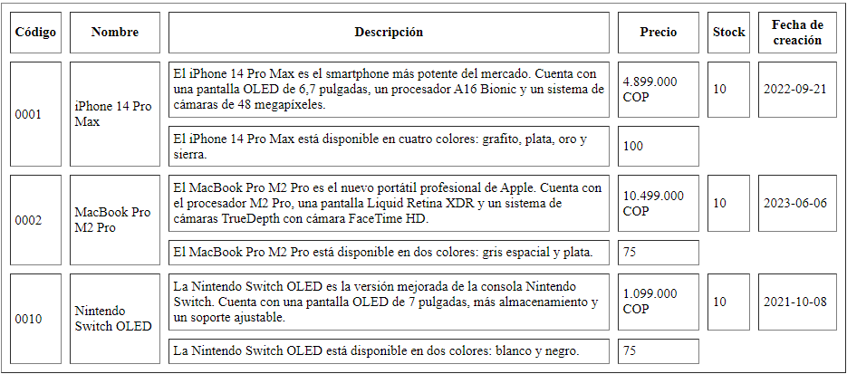

<!-- No borrar o modificar -->
[Inicio](./index.md)

## Sesión 4


# Actividad: Crear una tabla HTML con información sobre productos.


Escribir una tabla HTML con 10 filas que muestre información sobre productos reales. La tabla debe tener las siguientes columnas:

 - Código
 - Nombre
 - Descripción
 - Precio
 - Stock
 - Fecha de creación

 Además, combinar celdas en la tabla con los atributos rowspan y colspan, como se muestra en la siguiente imagen.

 

 # SOLUCION

  - Index

 ```html
 <!DOCTYPE html>

<<table border="1" cellpadding="5" cellspacing="10">
    <thead>
      <tr>
        <th>NOM</th>
        <th>Apellido</th>
        <th>Edad</th>
      </tr>
    </thead>
    <tbody>
      <tr>
        <td>Juan</td>
        <td>Pérez</td>
        <td>20</td>
      </tr>
      <tr>
        <td>María</td>
        <td>González</td>
        <td>25</td>
      </tr>
    </tbody>
  </table>

</html>
 
 ```

  - TABLA

```html
<!DOCTYPE html>
<table border="1" cellspacing="15" cellpadding="15">
    <thead>
        <tr>
            <th>Codigo</th>
            <th>Nombre</th>
            <th>Descripción</th>
            <th>Precio</th>
            <th>Stock</th>
            <th>Fecha de creacion</th>
        </tr>
    </thead>

    <tbody>
        <tr>
            <td rowspan="2">0001</td>
            <td rowspan="2">iphone 14 Pro Max</td>
            <td>el iphone 14 Pro max es el smartphone mas potente</td>
            <td>4.899.000 COP</td>
            <td>10</td>
            <td>2022-09-21</td>
        </tr>
        <tr>
            <td>el iphone 14 Pro max esta disponible en 4 colore</td>
            <td></td>
            <td>10</td>
        </tr>
        <tr>
            <td rowspan="2">0002</td>
            <td rowspan="2">MacBookProM2 Pro</td>
            <td>El MacBookProM2 es el nuevo portatil profesional</td>
            <td>10.499.000 COP</td>
            <td>10</td>
            <td>2023-06-06</td>
        </tr>
        <tr>
            <td>el iphone 14 Pro max esta disponible en 4 colores</td>
            <td></td>
            <td>7</td>
        </tr>
        <tr>
            <td rowspan="2">0003</td>
            <td rowspan="2">Nintendo Switch OLED</td>
            <td>La Nintendo Switch OLED es la versión anidada</td>
            <td>1.099.000 COP</td>
            <td>10</td>
            <td>2021-10-08</td>

        </tr>
        <tr>
            <td>La nintendo Switch OLED esta disponible en dos colores</td>
            <td></td>
            <td>10</td>

        </tr>

        <tr>
            <td rowspan="2">0004</td>
            <td rowspan="2">Samsung A32</td>
            <td>La mejor camara del mercado</td>
            <td>3.500.00</td>
            <td>75</td>
            <td>01/09/2023</td>
        </tr>

        <tr>
            <td>Samsung A32 solo esta disponible en plateado</td>
            <td></td>
            <td>50</td>
        
        </tr>

        <tr>
            <td rowspan="2">0005</td>
            <td rowspan="2">Patineta electrica</td>
            <td>5 Velocidades</td>
            <td>1.900.000</td>
            <td>10</td>
            <td>18/08/2023</td>

        </tr>
        <tr>
            <td>Patineta electrica disponible en solo tienda principal</td>
            <td></td>
            <td>15</td>

        </tr>

        <tr>
            <td rowspan="1">0006</td>
            <td rowspan="1">Galaxy Z</td>
            <td rowspan="1">Lo nuevo en velocidad de procesador</td>
            <td rowspan="1">2.000.000</td>
            <td rowspan="1">38</td>
            <td rowspan="1">02/09/2023</td>

        </tr>

        <tr>
            <td rowspan="1">0007</td>
            <td rowspan="1">Galaxy S23 Ultra 5G</td>
            <td rowspan="1">El renacimiento de Ultra</td>
            <td rowspan="1">6.450.000</td>
            <td rowspan="1">19</td>
            <td rowspan="1">25/08/2023</td>

        </tr>

        <tr>
            <td rowspan="1">0008</td>
            <td rowspan="1">Televisor LG 58 pulgadas</td>
            <td rowspan="1">Definicion UHD 4K</td>
            <td rowspan="1">3.900.000</td>
            <td rowspan="1">25</td>
            <td rowspan="1">04/09/2023</td>

        </tr>

        <tr>
            <td rowspan="1">0009</td>
            <td rowspan="1">Portatil lenovo S145</td>
            <td rowspan="1">Con procesador core i5</td>
            <td rowspan="1">2.000.000</td>
            <td rowspan="1">18</td>
            <td rowspan="1">01/09/2023</td>

        </tr>

        <tr>
            <td rowspan="2">0010</td>
            <td rowspan="2">Televisor Samsung 65 pulgadas</td>
            <td rowspan="1">Pantalla de cristal liquido</td>
            <td rowspan="1">4.500.000</td>
            <td rowspan="1">10</td>
            <td rowspan="1">04/09/2023</td>

        </tr>

        <tr>
            <td>Pantalla protegida</td>
            <td></td>
            <td>10</td>

        </tr>


    </tbody>
</table>
```


